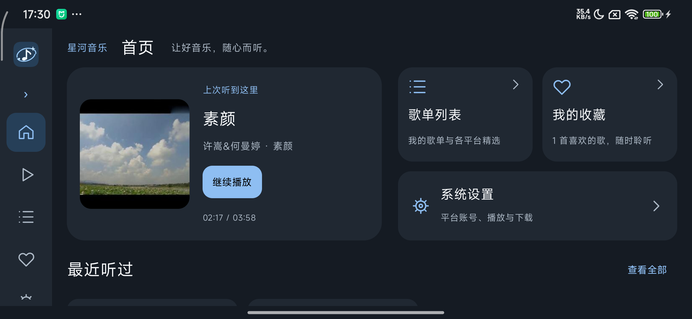
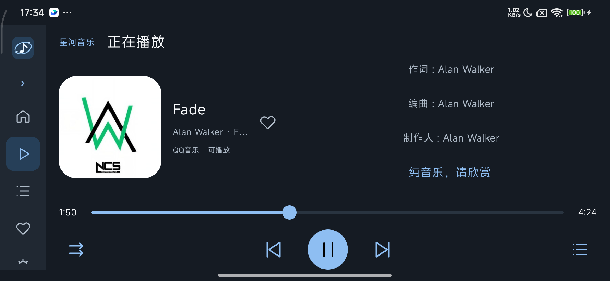
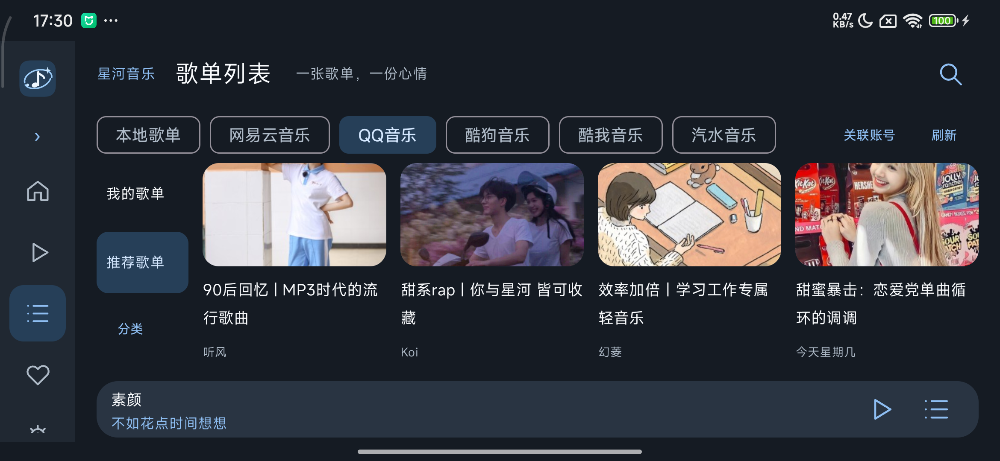
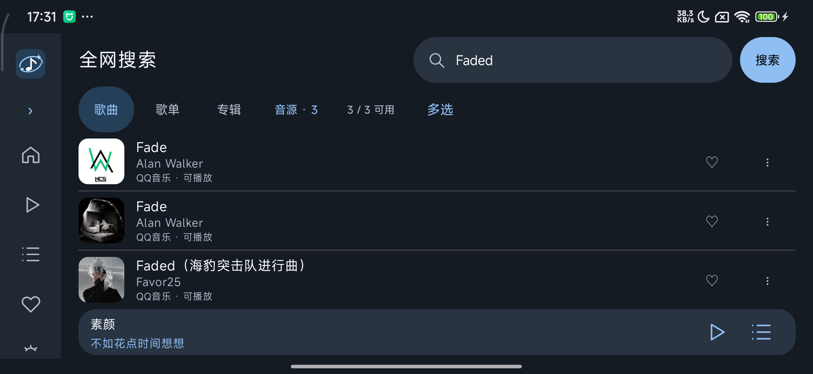
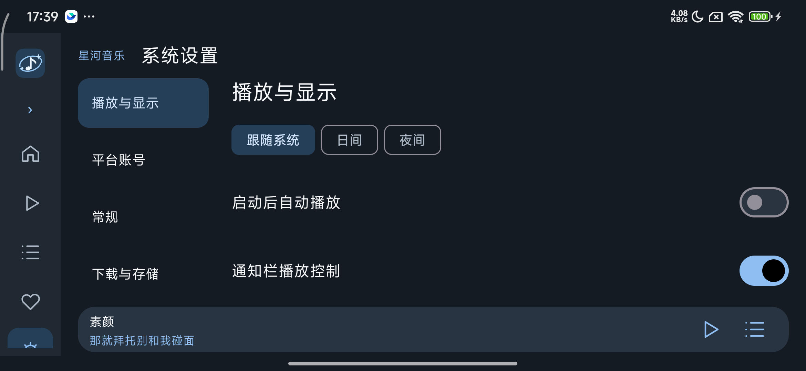
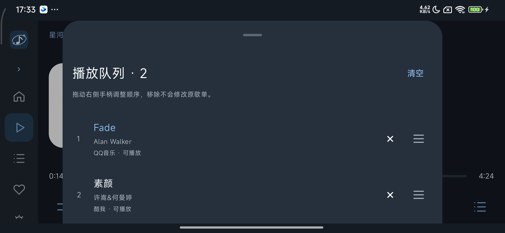

# 星河音乐 · CarMusic

**让好音乐，随心而听。**

适用于 Android 手机、平板及兼容设备的原生音乐播放器，兼容 Android 车机生态。汇集多平台歌曲与歌单，支持歌词、收藏、下载、本地音乐及自动换源。

Kotlin / Jetpack Compose 构建界面，Media3 / ExoPlayer 负责播放，搜索、平台歌单、账号关联、下载与自动换源复用 [GoMusicDll](https://github.com/guohuiyuan/go-music-dl)。

[下载 v1.5.0](https://github.com/liangle902/CarMusic/releases/tag/v1.5.0) · [项目仓库](https://github.com/liangle902/CarMusic)（私有仓库，需要授权访问）。Android 8.0 及以上，ARM64。

v1.5.0 支持竖屏与横屏自适应，手机旋转时自动切换布局，适配平板和横屏车机；v2.0.0 将在车机实测导航语音避让、媒体按键与播放状态同步后发布。

## 界面

横屏界面根据可用高度调整封面、歌词、列表和操作区；搜索结果占满内容宽度，音源通过筛选入口选择。

<table>
  <tr><th>横屏首页</th><th>横屏播放</th></tr>
  <tr><td></td><td></td></tr>
  <tr><th>横屏歌单</th><th>横屏搜索</th></tr>
  <tr><td></td><td></td></tr>
  <tr><th>横屏设置</th><th>横屏队列</th></tr>
  <tr><td></td><td></td></tr>
</table>

竖屏界面：

<table>
  <tr><th>首页</th><th>正在播放</th><th>播放队列</th></tr>
  <tr>
    <td></td>
    <td></td>
    <td></td>
  </tr>
  <tr><th>平台歌单</th><th>系统设置</th><th>我的收藏</th></tr>
  <tr>
    <td></td>
    <td></td>
    <td></td>
  </tr>
</table>

## 功能

- 横竖屏自动适配，共享搜索、歌单、账号和播放状态，旋转时保留当前页面与播放进度。
- 首页提供正在播放、歌单列表、我的收藏、系统设置四个模块；侧栏统一导航，可展开或收起。
- 日间、夜间、跟随系统主题；专辑封面与旋转黑胶可选，启动自动播放默认关闭。
- 长歌名单行向左滚动；图标控制上一首、播放／暂停、下一首；点击图标循环切换顺序、随机、单曲循环、列表循环。
- 逐行、逐字及翻译／音译歌词。滑动浏览，点击歌词跳转播放；停止浏览 2 秒后回到当前歌词。
- 当前播放队列支持右侧手柄拖动、实时让位、边缘滚动、移除和清空。播放整张歌单替换队列；单曲置于队首播放，保留其他歌曲。
- 支持多平台搜索、平台账号扫码关联、个人与推荐歌单、本地歌单和红心收藏。歌单多选后可下载所选或加入本地歌单。
- 本地音乐自动扫描媒体库和已授权目录，监听存储变化；U 盘首次添加目录授权后可持续扫描。移除本地引用保留原文件。
- 下载管理、播放缓存、失效自动换源和成功来源保存；播放队列操作不修改原歌单。
- 通知栏显示歌名、当前歌词及播放控制，可在设置中管理；支持系统媒体会话和音频焦点。
- 系统设置保留上游配置，包含 WebDAV、存储管理、代理、更新、维护工具和视频制作。

账号凭据由用户在应用内关联并保存在本机。源码与 APK 不预置个人账号。

## 源码与构建

| 目录 | 内容 |
| --- | --- |
| `app/` | Android 原生应用 |
| `engine/upstream/` | 上游 Go 源码、Android 宿主和 JSON 接口 |
| `app/src/main/jniLibs/arm64-v8a/` | ARM64 音乐引擎、FFmpeg / ffprobe 与运行库 |
| `design/portrait-v1/`、`design/landscape-v1/` | 横竖屏 HTML 界面原型 |
| `docs/` | 产品规格、第三方来源、截图与版本说明 |
| `scripts/` | Release 构建与导出脚本 |

包名 `com.carmusic.app`。引擎仅监听设备本机 `127.0.0.1`，端口由系统动态分配，服务路径 `/music`。

要求 JDK 17、Android SDK 34、Go 1.25.1 或兼容版本。通过本机 `local.properties` 配置 `sdk.dir`。构建无签名 APK：

```powershell
.\gradlew.bat :app:assembleRelease
```

输出 `app/build/outputs/apk/release/app-release-unsigned.apk`。正式附件使用独立签名，不允许调试。重新编译引擎并签名导出：

```powershell
.\scriptsuild-android.ps1 -KeyStore '仓库外的签名文件' -KeyAlias '签名别名' -ExportDirectory '交付目录'
```

签名口令通过进程环境变量 `CARMUSIC_SIGNING_PASSWORD` 提供。签名文件、口令、SDK 路径及运行数据不提交到仓库；已有安装迁移签名时，脚本支持传入签名谱系及原签名文件。

## 来源与许可证

功能来源：[GoMusicDll](https://github.com/guohuiyuan/go-music-dl)。项目保留 GNU AGPL v3 许可证与上游源码，详见 [LICENSE](LICENSE)、[上游基线](docs/UPSTREAM_ORIGIN.md) 和 [第三方说明](docs/THIRD_PARTY_NOTICES.md)。
