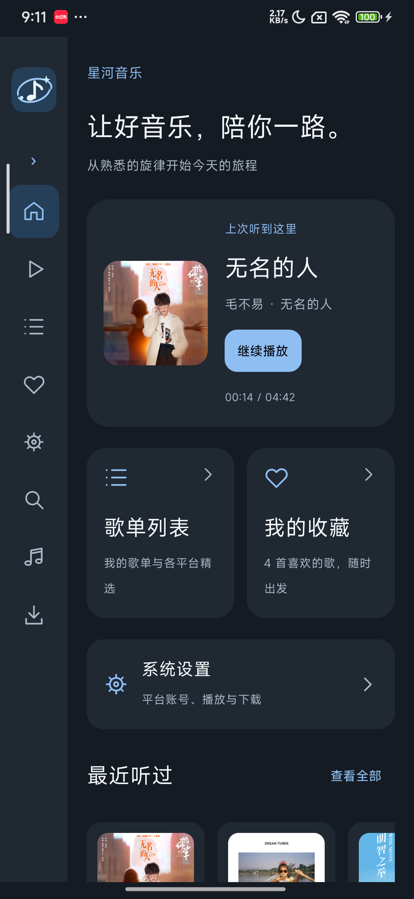
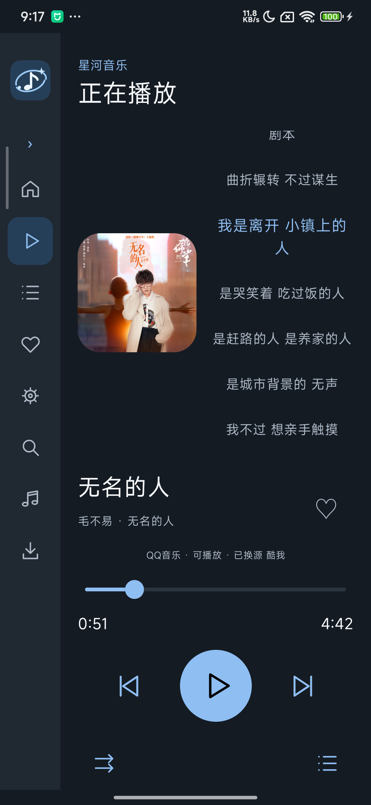
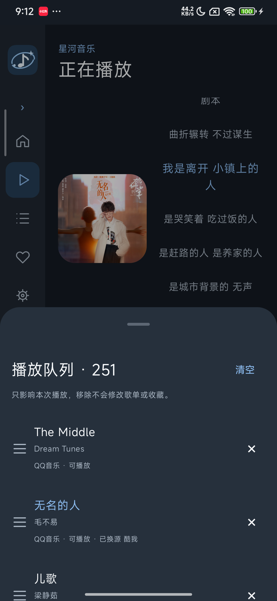
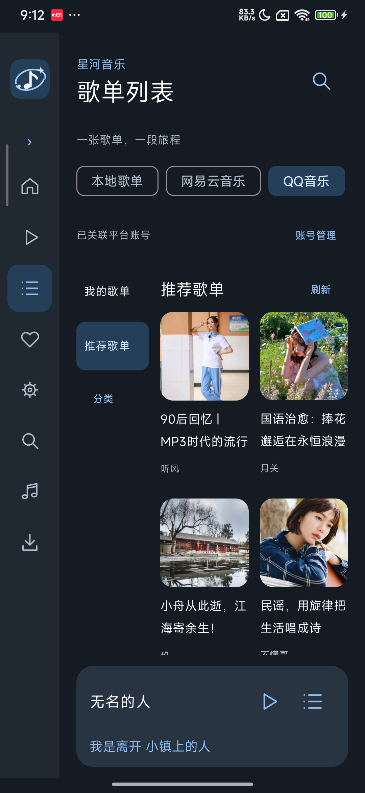
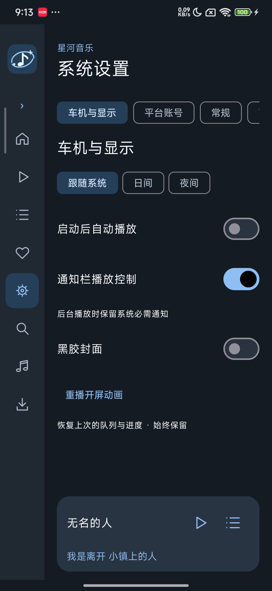
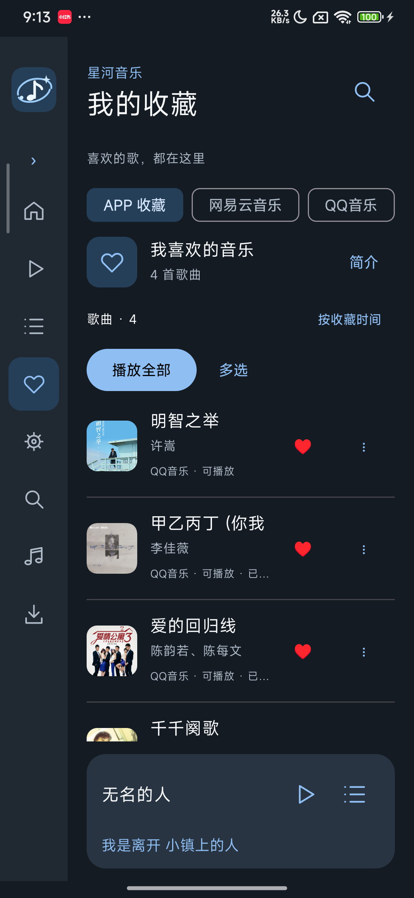

# 星河音乐 · CarMusic

**为每一段旅程，留一首好歌。**

项目仓库：[liangle902/CarMusic](https://github.com/liangle902/CarMusic)（私有，需授权访问）。

面向 Android 竖屏车机的原生音乐播放器，也适配竖屏手机。界面使用 Kotlin、Jetpack Compose，播放使用 Media3 / ExoPlayer；搜索、平台歌单、账号关联、下载与自动换源复用 [Go Music DL / GoMusicDll](https://github.com/guohuiyuan/go-music-dl)。

当前为开发验收版本。功能覆盖与实际验证结果以 [原安卓功能对比](docs/UPSTREAM_ANDROID_FEATURE_AUDIT.md) 为准，不能将接口接通或二维码生成视为平台账号登录成功。

## 真机截图

2026-10-03 在 Redmi K20 Pro / Android 14 上直接截取。手机截图展示竖屏适配，实车显示效果仍需车机验证。

<table>
  <tr><th>首页</th><th>正在播放</th><th>播放队列</th></tr>
  <tr>
    <td></td>
    <td></td>
    <td></td>
  </tr>
  <tr><th>平台歌单</th><th>系统设置</th><th>我的收藏</th></tr>
  <tr>
    <td></td>
    <td></td>
    <td></td>
  </tr>
</table>

## 日常使用

- 启动进入首页，自动播放默认关闭；侧栏提供正在播放、歌单列表、我的收藏、系统设置及搜索、本地音乐、下载管理入口。
- 日间、夜间、跟随系统三种主题，可收起侧栏；专辑封面与黑胶显示可选。
- 播放页使用图标控制上一首、播放／暂停、下一首；点击播放模式图标切换顺序、随机、单曲循环、列表循环。
- 歌词支持逐行、逐字及翻译／音译显示。滑动只浏览，点击歌词才跳转播放；停止滑动 2 秒未点击，自动回到当前歌词。
- 歌单顶部保留播放全部、收藏平台歌单及多选；下载、加入本地歌单等集中在多选操作中。
- 播放整张歌单时替换当前队列；点击单曲时置于队列首位，保留其他歌曲。播放页队列按钮打开实际队列，三横杠手柄支持长按拖动。
- 自动换源遵循设置开关，成功来源保存在本机；队列编辑不会删除真实歌单、收藏或音乐文件。
- 通知栏播放控制默认开启，显示歌名、当前歌词和三个播放按钮。关闭后隐藏前台卡片；后台播放保留 Android 必需的媒体通知。
- 平台账号优先提供上游支持的扫码入口，低频配置、WebDAV、维护工具与视频制作集中在系统设置；视频支持黑胶旋转、音乐频谱、逐字/翻译歌词和四种画幅导出。

## 工程目录

| 目录 | 内容 |
| --- | --- |
| `app/` | Android 原生应用、单元测试、独立包真机测试 |
| `engine/upstream/` | Go Music DL 源码及本项目的宿主、JSON 接口修改 |
| `app/src/main/jniLibs/arm64-v8a/` | ARM64 引擎、FFmpeg / ffprobe 与运行库 |
| `design/portrait-v1/` | 已确认的 HTML 交互原型 |
| `docs/` | 技术规格、功能对照、第三方来源及验证记录 |
| `scripts/` | 编译、安装、导出与原型队列检查脚本 |

引擎只监听本机 `127.0.0.1`。正式应用包名为 `com.carmusic.app`，独立测试包为 `com.carmusic.app.smoke`，分别使用端口 37777 和 37779。

## 本地构建

要求 JDK 17、Android SDK 34；重新编译引擎还需要 Go 1.25.1 或兼容版本。当前仅提供 `arm64-v8a`，最低 Android 8.0 / API 26。

在 `local.properties` 中配置本机 SDK 路径，例如：

```properties
sdk.dir=C:/Android/sdk
```

Windows PowerShell：

```powershell
$env:JAVA_HOME='你的 JDK 17 路径'
$env:ANDROID_HOME='你的 Android SDK 路径'
.\gradlew.bat :app:assembleDebug :app:testDebugUnitTest
```

输出为 `app/build/outputs/apk/debug/app-debug.apk`。仓库中的 ARM64 运行库用于本地开发构建；如修改 Go 引擎，运行：

```powershell
.\scripts\build-android.ps1
```

可选覆盖安装与文件导出：

```powershell
.\scripts\build-android.ps1 -Install -Serial '你的 ADB 设备编号' -ExportDirectory '你的交付目录'
```

Debug APK 使用本机 Android 调试签名。更换开发机器后若签名不同，无法直接覆盖原安装；正式分发需统一管理签名。

## 验证

真机测试使用独立测试包，避免测试运行器清除正式应用的数据：

```powershell
$env:ANDROID_SERIAL='你的 ADB 设备编号'
.\gradlew.bat :app:connectedSmokeAndroidTest
node .\scripts\verify-prototype-queue.cjs
```

手机需已授权 USB 调试并解锁。部分测试调用真实音乐平台，需要网络；扫码最终授权、平台限流、私人 WebDAV 服务及实车音频焦点另行验证。手机上的车机尺寸模拟不等于实车验证。

完整独立包真机回归 21 项通过，覆盖真实播放/歌词、通知、队列、换源、歌单布局、扫码、批量删除与视频流程。补齐频谱/逐字歌词后的视频专项 10 项、队列定位/字号自适应专项 5 项也全部通过；14 项单元测试及 Go `internal/web` 完整测试通过。原始报告位于 [docs/validation](docs/validation)，完整限制见 [实施状态](docs/IMPLEMENTATION_STATUS.md)。

## 来源与许可证

功能来源：[GoMusicDll · GitHub](https://github.com/guohuiyuan/go-music-dl)。保留上游 GNU AGPL v3 许可证及源码；Compose、Media3、FFmpeg 等组件的来源见 [第三方说明](docs/THIRD_PARTY_NOTICES.md)。

平台账号凭据、个人音乐文件、本机 SDK 路径、签名密钥和运行数据不属于源码交付内容。
